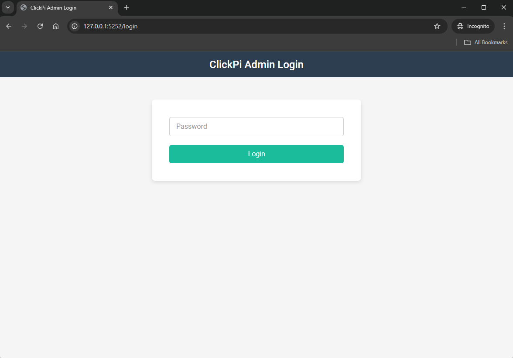
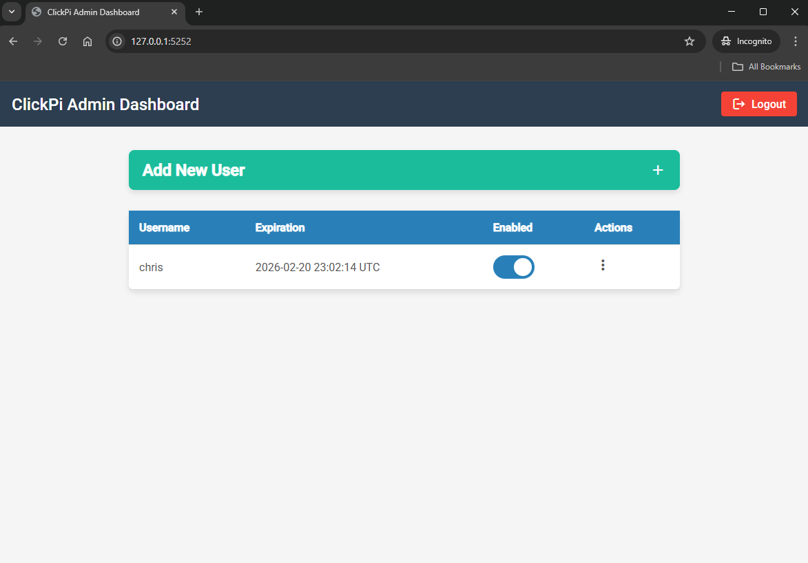
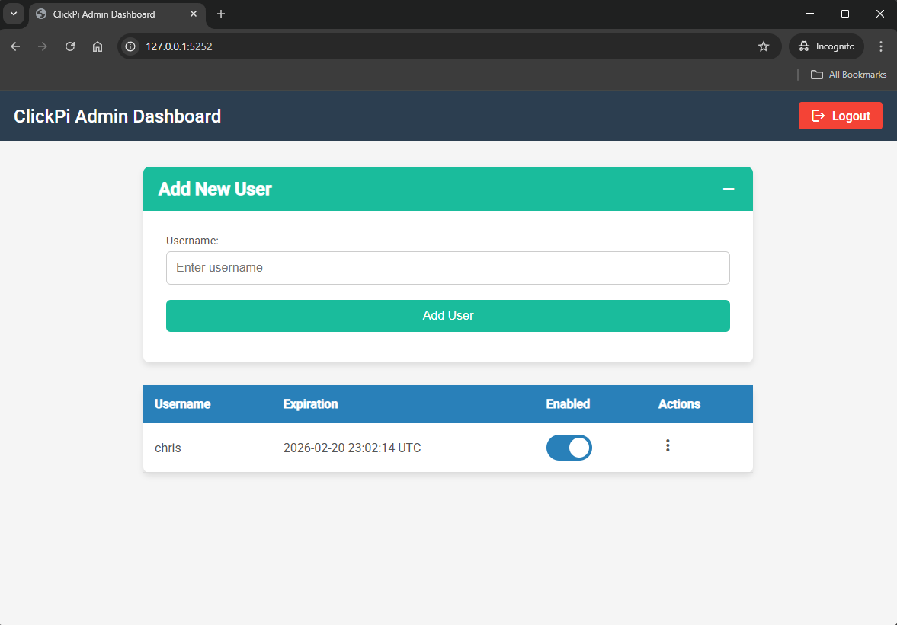
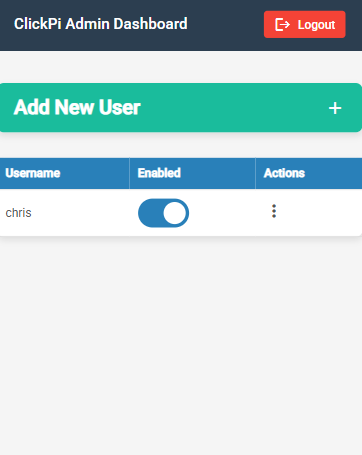
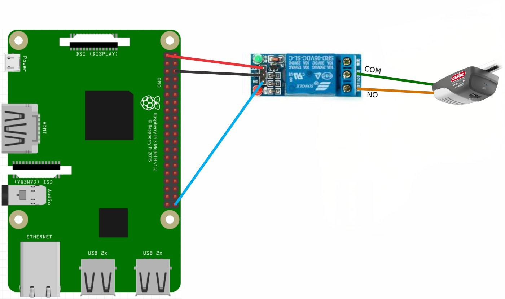

# ClickPi
This project comes as a pre-built Docker image that enables you to utilize a relay and Raspberry Pi to open a gate, garage door, trigger a deer feeder or anything else that involves shorting a circuit.
Includes a mobile-friendly admin dashboard and API endpoints that will allow you to manage users and control one or more relays from a single Raspberry Pi.

## Screenshots








## Hardware

This is the hardware I am using. You can certainly do this with less. A pi0, jumper wires, and any relay will work.

- [Raspberry Pi 3B+](https://www.raspberrypi.com/products/raspberry-pi-3-model-b-plus/)
- [Electronics-Salon RPi Power Relay Board](https://www.amazon.com/dp/B07CZL2SKN?ref_=ppx_hzsearch_conn_dt_b_fed_asin_title_1)

## Wiring


## Installation

### 1. Install Docker:
- [Docker Install Documentation](https://docs.docker.com/engine/install/debian/)

### 2. Add the current user to the docker group to avoid using sudo. You must log out and back in after doing this, otherwise you will need to sudo the rest of the commands!:
```bash
sudo usermod -aG docker ${USER}
```

### 3. Create a docker-compose.yml file:
```bash
mkdir clickpi && cd clickpi && nano docker-compose.yml
```

### 4. Add this to the YAML file with your own parameters:
```yml
  services:
    click_pi:
      image: christracy/clickpi
      restart: unless-stopped
      privileged: true
      environment:
        FRIENDLY_NAME: "My Garage Door"       # Name of the device you're controlling. Will show up in logs and responses
        SECRET_KEY: "LongSuperSecretKey"      # This can be anything but it should be long, random, and kept secret
        ADMIN_PASSWORD: "SuperSecretPassword" # Password for the admin panel
        GPIO_PIN: "16"                        # GPIO PIN used for the trigger route (this is the GPIO number, NOT the pin number)

        #API_EXPIRATION_DAYS: 90  # Number of days before the API token will expire (Default: 365)
        #CLICK_DELAY: .50         # Time between closing and opening the relay on the trigger route (Default: .10)
        #TRIGGER_LIMIT: 5         # The number of times the trigger routes can be called within 1 minute (Default: 8)
        
      volumes:
        - ./db:/data
        
      ports:
        - "5151:5151"
        - "5252:5252"

```

### 5. Bring up your stack by running:

```bash
docker compose up -d
```

## Updating

```bash
docker-compose pull
```

```bash
docker-compose up -d
```

## API

### These are the API endpoints for the server:

| Method   | URI                                      | Description                                                  |  Params             | Auth      |
| -------- | ---------------------------------------- | -------------------------------------------------------------| ------------------- |---------- |
| `POST`   | `{default_host}/api/v1/trigger`          | Triggers the relay with the default GPIO pin                 |                     | `api_key` |
| `POST`   | `{default_host}/api/v1/customtrigger`    | Triggers the relay but you can specify the GPIO pin and time | `pin` `click_delay`  | `api_key` |

## Clients

- **Home Assitant (HACS)** - Add this to your custom repositories in hacs for a garage door: `https://github.com/christracy/clickpi_garage_door`. For detailed instructions refer to the [clickpi_garage_door repo](https://github.com/christracy/clickpi_garage_door).